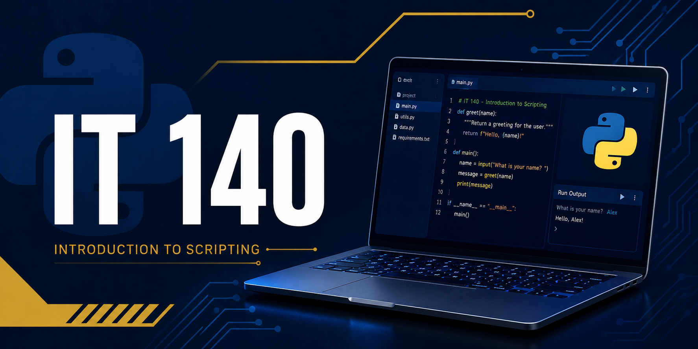

<!-- To see this file in a clean, formatted view, select "Text Editor ▼" in the upper-right corner of the editor, then select "Markdown Preview". -->

# IT 140: Introduction to Scripting

---

> [!NOTE]
> **🆕 New for 2026 C-5:** IT 140 now uses GitHub repositories to provide assignment starter files, development resources, and supporting documentation.
>
> If you find a problem with this GitHub repository or its instructions, or have a suggestion for improvement, please open [GitHub Issues](https://github.com/GC-STEM/it140/issues) to review existing issues or create a new issue.

---

- **Course**: IT 140 - *Introduction to Scripting*
- **Repository Title**: Main Course Repository
- **Repository Type**: Student-facing course hub
- **Repository Version**: 1.0.3
- **Repository Version DTG**: 2026-09-02-09-37

This repository is the central GitHub hub for **IT 140 - Introduction to Scripting**. Use it to find the setup, template, assignment, and project repositories used throughout the course.

This repository also contains the automation scripts used to prepare, configure, verify, and maintain the IT 140 course development environment across supported platforms.

## Course Task Repositories

Click the desired link in the **Task** column to go to that repository. The **Local Repos Folder** column shows the name of the repository sub-directory that will appear in your `$HOME/Repos` directory after cloning.

| **Module** | **Task** | **Local Repos Folder** | **Status** | **Notes** |
| ---------- | -------- | ---------------------- | :--------: | -------- |
| One | [Setup Tasks](https://github.com/GC-STEM/it140-m1-setup-tasks) | N/A | 🟢 | Ready; no known issues. |
| Two | [Assignment](https://github.com/GC-STEM/it140-m2-assignment) | `it140-m2-assignment` | 🟢 | Ready; no known issues. |
| Three | [Assignment](https://github.com/GC-STEM/it140-m3-assignment) | `it140-m3-assignment` | 🟢 | Ready; no known issues. |
| Four | [Assignment](https://github.com/GC-STEM/it140-m4-assignment) | `it140-m4-assignment` | 🟢 | Ready; no known issues. |
| Five | [Project One](https://github.com/GC-STEM/it140-projects) | `it140-projects/design` | 🟢 | Ready; no known issues. |
| Six | [Milestone](https://github.com/GC-STEM/it140-projects) | `it140-projects/prototype` | 🟢 | Ready; no known issues. |
| Seven | [Project Two](https://github.com/GC-STEM/it140-projects) | `it140-projects/src` | 🟢 | Ready; no known issues. |
| F & S | [Support](https://github.com/GC-STEM/it140-support) | N/A: Faculty and Staff | 🟢 | Ready; no known issues. |

<!--
Status\tMeaning\tStandard note
🟢\tReady\tReady for use; no known issues.
🟡\tCaution\tUsable with known issues or pending updates.
🔴\tBlocked\tNot ready for use; blocking issue requires resolution.
 -->

*Note*. Modules Five through Seven use the same project repository. The Faculty and Staff (F&S) Support repository contains support guides for faculty, LSS, advisors, and technical support to help students with the course.

Follow the task *Guidelines and Rubric* page in **D2L Brightspace** and the README for the task you are completing. Brightspace remains the authoritative location for task requirements, submissions, grading, and instructor feedback.

If an expected repository or course resource is unavailable, check [Course Status](https://github.com/GC-STEM/it140/wiki/Course-Status).

## Setup Tasks

### First-Time/Full Setup

If you are setting up your IT 140 development environment for the very first time, start here:

**[IT 140 Module One: Setup Tasks](https://github.com/GC-STEM/it140-m1-setup-tasks)**

The full setup process guides you through setting up a **GitHub account** and the **Codio Virtual Desktop (CVD)**. You may also configure the course IDE on a supported local Windows, macOS, or Linux computer.

### Setup After Resetting Your CVD

If you have just reset your Codio Virtual Desktop (CVD), select:

**[Setup Tasks | Codio Virtual Desktop](https://github.com/GC-STEM/it140-m1-setup-tasks/tree/main/codio)**

The CVD setup process guides you through configuring the course IDE on your CVD. It assumes you already have a GitHub Account.

### Setup After Resetting Your Computer

If you are setting up the course IDE on a supported local computer, select:

**[Setup Tasks | Local Computer](https://github.com/GC-STEM/it140-m1-setup-tasks/tree/main/local)**

The local computer setup process guides you through configuring the course IDE on your computer. It assumes you already have a GitHub Account and a functioning development environment on the Codio Virtual Desktop (CVD).

## Course Automation

This repository contains the scripts used to prepare and maintain the IT 140 course IDE across supported environments.

Follow the commands provided in the Module One Setup Tasks repository or other course instructions. You do not need to manually download, clone, or run scripts simply because they appear in this repository.

To learn more:

* [Course Automation](https://github.com/GC-STEM/it140/wiki/Course-Automation) - Learn what the Prepare, Install, Configure, Verify, and Update stages do.
* [Automation Scripts](scripts/README.md) - View additional technical information about the course automation.

## Learn More

The README files contain the instructions needed to complete course tasks. The Wikis provide supplemental explanations, technical background, and opportunities to explore beyond the task requirements.

* [IT 140 Main Course Wiki](https://github.com/GC-STEM/it140/wiki)
* [Course Repositories](https://github.com/GC-STEM/it140/wiki/Course-Repositories)
* [Course IDE and Tools](https://github.com/GC-STEM/it140/wiki/Course-IDE-and-Tools)
* [Course Automation](https://github.com/GC-STEM/it140/wiki/Course-Automation)

## Help and Support

* **Current availability or known issue:** [Course Status](https://github.com/GC-STEM/it140/wiki/Course-Status)
* **Module One setup problem:** [Setup Problems and Support](https://github.com/GC-STEM/it140-m1-setup-tasks/wiki/Setup-Problems-and-Support)
* **Course-wide technical problem or requested improvement:** [GitHub Issues](https://github.com/GC-STEM/it140/issues)
* **Question or discussion:** [GitHub Discussions](https://github.com/GC-STEM/it140/discussions)

Do not post passwords, authentication codes, access tokens, private identifying information, or complete solutions to graded assignments in public GitHub areas.

## Faculty and Staff

Faculty should also review the [IT 140 Faculty Guide](.faculty/README.md) for information about the course environment, repository model, student workflow, and faculty support resources.

Faculty, Learning Support Specialists (LSS), academic advisors, and technical support staff should review the [IT 140 Support Repository](https://github.com/GC-STEM/it140-support) for information about supporting students in the course, including how to access the course IDE, troubleshoot common problems, and provide technical support.
