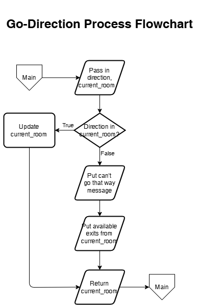
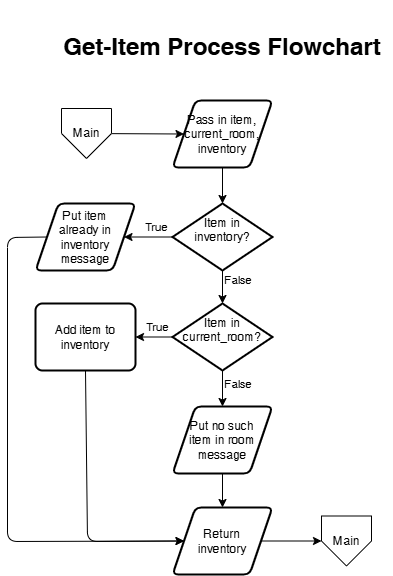

<!-- To see this file in a clean, formatted view, right-click README.md and choose “Open Preview.” -->

<!-- To edit and preview this file at the same time, open the file in both modes and split the screen. For how to do this, see VS Code: https://code.visualstudio.com/docs/getstarted/userinterface#_side-by-side-editing or PyCharm: https://www.jetbrains.com/help/pycharm/using-code-editor.html#split_screen -->

# Game Design Document

## Table of Contents
<!-- Do NOT change the markdown code below -->
1. [Theme](#1-theme)
   1.1. [Setting](#11-setting)
   1.2. [Villain](#12-villain)
   1.3. [Player Goal](#13-player-goal)
   1.4. [Rooms](#14-rooms)
   1.5. [Items](#15-items)
   1.6. [Acknowledgements](#16-acknowledgements)
2. [Game World](#2-game-world)
   2.1. [Rooms Table](#21-rooms-items-table)
   2.2. [Graphical Map](#22-graphical-map)
3. [Requirements](#3-requirements)
   3.1. [Inputs](#31-inputs)
   3.2. [Processes](#32-processes)
   3.3. [Outputs](#33-outputs)
4. [Move Process](#4-go-process)
   4.1. [Flowchart](#41-go-process-flowchart)
   4.2. [Pseudocode](#42-go-process-pseudocode)
5. [Get Process](#5-get-process)
   5.1. [Flowchart](#51-get-process-flowchart)
   5.2. [Pseudocode](#52-get-process-pseudocode)
6. [References](#6-references)

## 1. Theme

<!--
OVERVIEW – HOW THIS SECTION IS GRADED

Rubric criteria supported here:
1) Storyboard: Theme
2) Clear Communication

To MEET expectations for Storyboard: Theme:
- Clearly describe your game’s theme and basic storyline.
- Identify the rooms, items, and villain that will appear in your game.
- Make sure the story is understandable, on-topic, and directly supports the text adventure game requirements.

To EXCEED expectations for Storyboard: Theme:
- Make your theme creative and insightful (not just “generic”).
- Show how your rooms, items, and villain all fit together logically in the story.
- Add just enough detail to help a reader imagine the game world and understand why your main character is doing what they’re doing.

To MEET expectations for Clear Communication:
- Write in complete sentences and organized paragraphs.
- Use headings (1.1–1.5) correctly.
- Make your writing clear, readable, and appropriate for a first programming course.

To EXCEED expectations for Clear Communication:
- Use transitions so your sections flow naturally (Setting → Villain → Player Goal → Rooms → Items).
- Keep your language concise, specific, and consistent with your chosen theme.
- Avoid confusing wording, run-on sentences, and off-topic details.

You MAY use generative AI to help you embellish game lore for your theme. Just be sure to cite such use in section 6. References.

See sample/theme.md for a fully worked example.
-->

### 1.1 Setting

<!--
INSTRUCTIONS FOR 1.1 SETTING

To MEET expectations:
- Write 3–6 sentences that describe WHERE and WHEN your game takes place.
- Briefly explain who the player is (role or identity).
- Mention the general environment (e.g., space station, haunted house, medieval village, sci-fi lab, spy headquarters, etc.).

To EXCEED expectations:
- Explain why this place matters (e.g., it protects people, hides secrets, controls important technology).
- Include 1–2 vivid but clear sensory details (what the player might see, hear, or smell).
- Connect the setting to the upcoming conflict (hint at the problem without fully re-explaining the villain).

TIP: Look at sample/theme.md to see how the “Harvesttide Feast in a modest stone castle” example does this.
-->

TODO: Replace with a description of your setting.

### 1.2 Villain

<!--
INSTRUCTIONS FOR 1.2 VILLAIN

To MEET expectations:
- Identify your villain (or main threat) clearly by name or type (e.g., dragon, rogue AI, ghost, hacker, monster, spy).
- Explain in 2–4 sentences what makes this villain a problem for the player and the game world.
- Connect the villain to your setting (the villain should make sense in your world).

To EXCEED expectations:
- Describe the villain’s behavior or personality in a way that fits the theme (e.g., “mischievous,” “cold and logical,” “vengeful,” “corrupted”).
- Explain what is at stake if the villain is not stopped (people, data, secrets, safety, etc.).
- Optionally, mention any legends, rumors, or history that make the villain more interesting.

TIP: In sample/theme.md, notice how the young dragon is tied to shire legends and the Harvesttide Feast.
-->

TODO: Replace with a description of your villain.

### 1.3 Player Goal

<!--
INSTRUCTIONS FOR 1.3 PLAYER GOAL

To MEET expectations:
- State clearly what the player must do to “win” the game.
- Connect the goal to collecting items and avoiding the villain until the player is ready.
- Use 2–4 sentences to explain what success and failure look like.

To EXCEED expectations:
- Explain WHY the player’s goal matters to others (villagers, crew, family, city, etc.), not just to the player.
- State the goal in a way that feels urgent or meaningful (e.g., protecting a festival, preventing a system crash, rescuing someone).
- Make sure the goal logically follows from the Setting and Villain sections, creating a smooth narrative flow.

TIP: Compare your goal text with sample/theme.md to see how the dragon example ties the player’s success to the safety of the shire and the feast.
-->

TODO: Replace with an explanation of your player's goal.

### 1.4 Rooms

<!--
INSTRUCTIONS FOR 1.4 ROOMS

This section introduces your rooms in words. The visual map will be handled separately.

To MEET expectations:
- Clearly state that your game has EIGHT (8) rooms.
- Briefly describe how these rooms fit into the game world (e.g., part of a space station, floors of a tower, sections of a lab).
- Provide a numbered list of all rooms with 1–2 sentences each explaining what they are.

To EXCEED expectations:
- Show how the rooms reflect everyday life or operations in your setting (not just random locations).
- Use details that match your theme but keep each description short and readable.
- Make sure the villain’s room does NOT contain an item and the start room has NO item.
- Highlight the villain’s room in a way that feels special or dangerous without rewriting the entire story.

TIP: In sample/theme.md, notice how each room in the castle (library, dungeon, gallery, etc.) has a clear purpose AND matches the lore.
-->

TODO: Replace text with a short paragraph introducing how your rooms fit into the world.

0. **Room0 Name**. TODO: Replace with 1–2 sentence lore-based description of room0 (the start room).
1. **Room1 Name**. TODO: Replace with room1 description.
2. **Room2 Name**. TODO: Replace with room2 description.
3. **Room3 Name**. TODO: Replace with room3 description.
4. **Room4 Name**. TODO: Replace with room4 description.
5. **Room5 Name**. TODO: Replace with room5 description.
6. **Room6 Name**. TODO: Replace with room6 description.
7. **Room7 Name**. TODO: Replace with room7 description (villain room).

<!--
REMINDERS:
- Room0 is your START room (no item).
- Room7 is your VILLAIN room (no item).
- The other rooms each contain exactly one item (you will name those items in 1.5 Collectibles).
-->

### 1.5 Collectibles

<!--
INSTRUCTIONS FOR 1.5 Collectibles

To MEET expectations:
- List SIX (6) items the player must collect.
- Make sure each item is clearly tied to a room you listed in 1.4.
- Use the exact item names (e.g., **Book**, **Shield**) the player will type in your game (for example: `get book`).
- Briefly explain what each item is or why it matters.

To EXCEED expectations:
- Connect the items to your game’s lore or history (e.g., relics, tools, artifacts, data drives, talismans).
- Explain how the items help the player prepare to face the villain (knowledge, protection, power, access, etc.).
- Use 1–2 sentences of “flavor text” per item that make sense in your world but are still easy to understand.
- Keep the **bold** item names simple and clear so they work well in player commands.

TIP: sample/theme.md shows how each relic (Book, Sword, Shield, etc.) is part of the shire’s legacy and has a clear purpose in the dragon encounter.
-->

TODO: Replace text with a short introductory paragraph explaining why the items are important.

Required items you must gather to defeat the villain:

1. **Item1** — TODO: Replace with 1–2 sentence lore-based description of item1.
2. **Item2** — TODO: Replace with item2 description
3. **Item3** — TODO: Replace with item2 description
4. **Item4** — TODO: Replace with item2 description
5. **Item5** — TODO: Replace with item2 description
6. **Item6** — TODO: Replace with item2 description

<!-- NOTE: Do NOT change the **bold** item names once you decide them, because players will need to type them exactly the same way in Project Two (e.g., get Item1).
-->

## 2. Map of Game World

### 2.1. Rooms Table

<!-- TODO: Replace <placeholder text>, including delimiters ("<...>"), with the names of your rooms and items in all lowercase. Names should match your graphical map, except for case. -->

| # | Room Name     | Item Name         | North | South | East  | West  | x, y |
|:-:|---------------|-------------------|:-----:|:-----:|:-----:|:-----:|:----:|
| 0 | <room0 name>  | None (Start Room) |   7   |  ---  |  ---  |   1   | 0, 0 |
| 1 | <room1 name>  | <item1 name>      |   2   |  ---  |   0   |  ---  | 1, 0 |
| 2 | <room2 name>  | <item2 name>      |   3   |   1   |  ---  |  ---  | 0, 1 |
| 3 | <room3 name>  | <item3 name>      |  ---  |   2   |  ---  |   4   | 0, 2 |
| 4 | <room4 name>  | <item4 name>      |  ---  |  ---  |   5   |   3   | 1, 2 |
| 5 | <room5 name>  | <item5 name>      |  ---  |   6   |  ---  |   4   | 2, 2 |
| 6 | <room6 name>  | <item6 name>      |   5   |  ---  |  ---  |   7   | 2, 1 |
| 7 | <room7 name>  | None (<Villain>)  |  ---  |   0   |   6   |  ---  | 1, 1 |

### 2.2. Graphical Map

<!-- TODO: Make all changes to the graphical map in the `game_map.drawio` file. See the README page in the .drawio file for additional instructions on how to update the map. -->

<!-- NOTE: Below is how you link/display an image in a markdown file.-->
<!-- Do NOT change the markdown code below. -->


## 3. Requirements

### 3.1. Inputs

#### 3.1.1. Constants

1. INSTRUCTIONS: str – A multiline string containing player instructions
2. ROOMS: dict – Representation of game world in code

#### 3.1.2 Player Commands

| # | Verb | Object       | Members | Effect if valid in current room|
|:-:|-----:|:-------------|:--------|---------|
| 0 |`exit` or `quit`| --- | --- | Exits the game. Valid in all rooms. |
| 1 |  `go`| \<direction> | north, east, south, west | Moves player to new room |
| 2 | `get`| \<item>      | items in rooms dictionary | Add's item to player's inventory |
| 3 |`show`| \<message>   | instructions, status | Displays desired message. Valid in all rooms |

Game loop must be robust and handle all player input without crashing or exiting unintentionally (i.e., 'exit' or game over)

### 3.2. Processes

1. Game start actions
2. Main loop actions
    2.1. Display player status
    2.2. Get player command
    2.3. Parse player command
    2.4. Decide if command syntax is valid
3. Game over actions

### 3.3. Outputs

1. Game instructions
2. Player status—current room and items in inventory
3. Error message(s) for invalid commands
4. Game over messages (won, lost, quit)

## 4. Move Process

### 4.1. Move Process Flowchart

<!-- Do NOT change the markdown code below. -->


### 4.2. Move Process Pseudocode

<!-- TODO: Implement the provided Move Process Flowchart in pseudocode so that it is a complete solution ready for the development phase of the I2P SDLC (i.e., writing Python code). -->

```i2p-pseudo

TODO: Paste your finished Move Process pseudocode here without the instructional comments in the provided starter code.

```

## 5. Get Process

### 5.1. Get Process Flowchart

<!-- Do NOT change the markdown code below. -->


### 5.2. Get Process Pseudocode

<!-- TODO: Implement the provided Get Process Flowchart in pseudocode so that it is a complete solution ready for the development phase of the I2P SDLC (i.e., writing Python code). -->

```i2p-pseudo

TODO: Paste your finished Get Process pseudocode here without the instructional comments in the provided starter code.

```

## 6. References

George, C. (2025, December 10). IT 140 sample dragon text game storyboard [Supporting materials]. SNHU. https://learn.snhu.edu/{OrgUnitPath}/course_documents/IT%20140%20Sample%20Dragon%20Text%20Game%20Storyboard.pdf?ou={OrgUnitID}

Gutschow, M. (2024, June 6). IT 140 sample dragon text game output [Supporting materials]. SNHU. https://learn.snhu.edu/{OrgUnitPath}/course_documents/IT%20140%20Sample%20Dragon%20Text%20Game%20Output.pdf?ou={OrgUnitID}

SNHU. (n.d.). IT 140 project one guidelines and rubric [LMS]. SNHU. D2L Brightspace. https://learn.snhu.edu/d2l/

SNHU Media. (2020, September 10). IT 140 sample dragon text game walkthrough [Video recording]. https://www.youtube.com/watch?v=KvmAaQWWMWE

<!-- TODO: If your game lore is based on another's work (e.g., LOTR, Halo, Sponge Bob), add a reference entry in proper alphabetical order.-->
